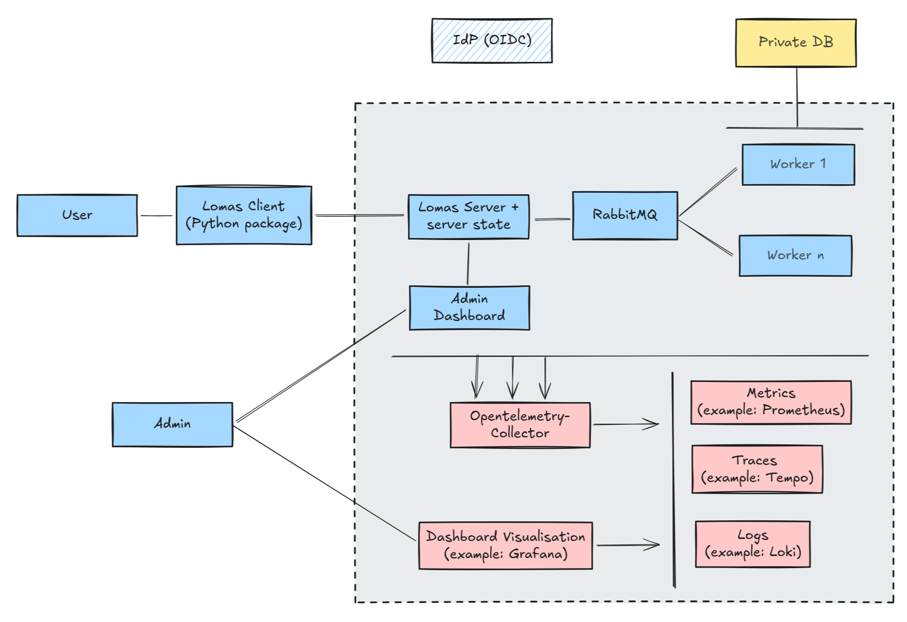
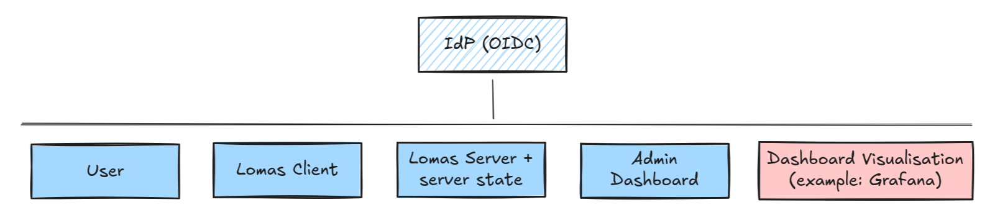

# Architecture Overview

Lomas is a platform for remote data science. Users send their algorithms to the Lomas server API using the Lomas client Python package. The Lomas platform verifies the user has access rights to the dataset and the differential privacy budget is sufficient before executing the algorithm and returning the DP-protected result to the user. The user never gets direct access to sensitive data.

Below is an architecture sketch for the Lomas platform.

The following communicate with the IdP provider:

## Client

The ``lomas-client`` Python package (available on PyPi) is a dedicated client to interact with the Lomas server.
Utilizing this client library is strongly advised for querying and interacting with the
server, as it takes care of all the necessary tasks such as authentication, query serialization and response deserialization,
API calls, and ensures the correct installation of other required libraries. In short,
it enables a seamless interaction with the server.

For additional informations about the client, please see the
[client quickstart page](client/quickstart.md) or [the example notebooks](client/index-notebooks.md).

## Server

The server is implemented in a micro-service architecture and is thus split into multiple parts:

- The client-facing HTTP server (which we call server for brevity) handles incoming requests and manages the administration database (Python Shelf).
- The administration database: as stated above, it is directly managed by the server and persisted on local disk (Python Shelf). The database serves as a repository for users and metadata about the datasets. User-related data include access permissions to specific datasets, allocated and used DP-budgets as well as query archives (past executed queries and their result). User role is also stored in the database (ie. admin or standard user). Dataset-related data includes information such as dataset names, links to credentials for accessing the sensitive datasets and dataset metadata for DP-related operations.
- The workers run user queries.
- RabbitMQ acts as a queue between the server and the workers. It is also used to implement RPC calls from the workers to the server (e.g. admin database calls).
- The admin dashboard provides a graphical interface for Lomas administrators to interact with the server. User creation, budget updates as well as dataset updates can all be executed through the dashboard.
- Telemetry: All components send metrics and logs to Opentelemetry-collector. The Grafana dashboard can be used to visualize the collected data.

Lomas is not responsible for storing and managing private datasets, these are usually already stored on the provider's infrastructure (private database in the sketch above). We currently implement adapters to S3 storage, http file download and local files.

The IdP provider is also not part of the Lomas platform and should be managed externaly. Our examples use Dex as an IdP: this is only for demo purposes and should not be used in production!

For more information about the server, see the [server administration page](server/administration.md). The [deployment page](server/kubernetes.md) goes through how to deploy the platform to a Kubernetes cluster via Helm.

__Note__: The Lomas Python code is split into a client (`lomas-client`) and a server (`lomas-server`) package. The `lomas-core` package serves as a base for the code that is common to both main packages.
